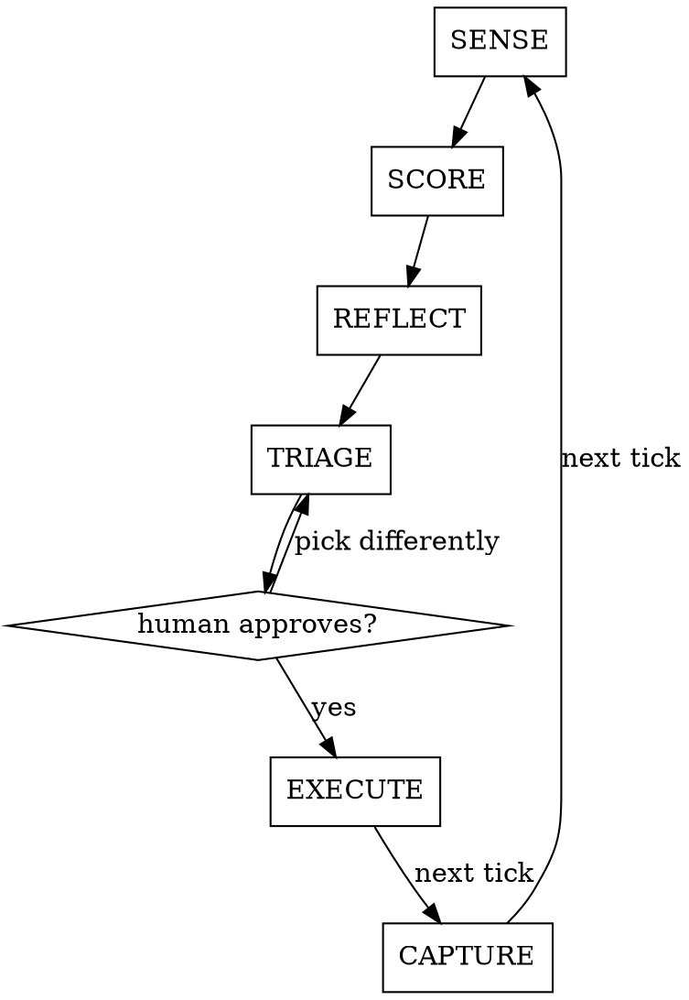

# Hive

A scoring-and-improvement loop for The Hive buildathon. The rubric (8 parameters, L1–L5)
is an **external verifier you do not control** — that is the only reason scoring your own
build can compound rather than turn into self-congratulation.

## Two hard rules

**1. RUN IT, DON'T READ IT.** A level is earned by an execution result, never by reading
code, a README, a plan, or a checkbox. Uncited claim → the parameter is UNVERIFIED and
**capped at L2**.

**2. Nothing in `evidence/` means L1.** Not "L3 in progress." The handbook scores "the
demonstrated product, not the pitch, architecture diagram, or number of APIs connected."

Both rules come from a measured failure: three agents scoring one project returned 16, 18
and 20 / 40, and two of them scored a program whose entry point imported a file that did
not exist. See `references/judging.md`.

## Modes

| Command | Does |
|---|---|
| `/hive` | One tick of the loop (default) |
| `/hive pick` | Eligibility check → idea + track selection → lock `IDEA_SCOPE.md` |
| `/hive score` | Judge only — the 8 parameters, nothing else |
| `/hive plan` | Triage only — rank the next moves |
| `/hive prove <param>` | Build the missing evidence artifact for one parameter |
| `/hive demo` | Write `DEMO.md` (30/30/120) + fallback recording check |
| `/hive submit` | Final gate against the submission window |

## The tick



1. **SENSE** — read `.hive/state.json`, diff the repo since last tick, compute hours to
   the 6:00 PM Aug 30 freeze. Load `references/clock.md`.
2. **SCORE** — dispatch the judge subagent per `references/judging.md`. Its context is the
   rubric, the judging protocol, and the project — **never** the plan, the previous
   scorecard, or your hopes. It cannot rationalize what it has not been told, and a clean
   context is what makes two ticks comparable.
3. **REFLECT** — write `.hive/reflections.md`. What moved, what did not, and **how last
   tick's hour estimates compared to reality**. Carry the correction factor forward; a
   loop that never recalibrates keeps promising the same wrong numbers.
4. **TRIAGE** — rank candidate level-ups by Δpoints ÷ estimated hours, **filtered by what
   `clock.md` says is still winnable**. A 3-point Virality gain at T+20 is worth zero.
5. **COMMIT** — present the top 1–3 with costs. **Stop and wait.** The loop never
   auto-executes a build decision; a human picks.
6. **EXECUTE** — build it. Normal development workflow applies.
7. **CAPTURE** — write the artifact into `evidence/`. Work that leaves no artifact did not
   happen, because at 6 PM the judge sees only what is on disk.

## Output contract

Every parameter, every tick, emits exactly this:

```
<PARAM>  L<n>  (VERIFIED|UNVERIFIED)
  evidence:  <command run → its output, or path → the fact it shows>
  objection: <strongest challenge a hostile judge raises>
  next:      <the ONE artifact that raises this a level>
  cost:      <hours>
```

`next` and `cost` are required. A row without them is an opinion, not a loop input.

Then exactly one total line, same basis every tick:

`TOTAL: n/40 · primary track <T> at L<n> · binding constraint: <param>`

Score all 8 parameters always. Never invent a second denominator (`/25`, `/30`) or report
two competing totals — see the track-scoring note in `judging.md`.

## State

In the build repo — `.hive/state.json` (phase, locked idea, primary track, tick count,
eligibility answers) · `.hive/scorecard.md` · `.hive/reflections.md` · `.hive/gaps.md` ·
plus `evidence/`, `IDEA_SCOPE.md`, `DEMO.md`.

## Red flags — stop and go run something

- "The test asserts the right thing" → an assertion is not a result
- "The README says it's wired up" → the README is the pitch
- "PLAN.md has it checked off" → that is a claim by the person being scored
- "It's a stub but swapping it in is trivial" → then swap it and re-run
- "I can see the logic is correct" → inference is what produced a two-level spread
- "It ran earlier" → cite that output or run it again
- Scoring a parameter before the Step 0 smoke check passes
- Any level that rose since last tick with **no new artifact** → drift, revert it

## References

`rubric.md` (verbatim ladders — quote, never paraphrase) · `judging.md` (protocol +
smoke check + dispatch prompt) · `evidence.md` (artifact per level, directory layout) ·
`clock.md` (what is still winnable at hour N) · `playbooks.md` (level-up recipes) ·
`gates.md` (eligibility, framing lock, submission).

## Mode notes

**`pick`** — run Gate 1 eligibility (`gates.md`) *first*; an ineligible idea scores zero
regardless of quality. Then: surface the team's real edge, generate candidates, project
each one's realistic **ceiling** on all 8 parameters given hours remaining, and commit.
Write `IDEA_SCOPE.md`: one user, one job, one observable outcome, primary track. Framing
locks here — later ticks may sharpen it, not replace it.

**`prove <param>`** — find the recipe in `playbooks.md`, build the artifact, put it where
`evidence.md` says, then re-score only that parameter.

**`submit`** — `gates.md` Gate 3. Clone your own public repo into a clean directory and
follow your own README before declaring done.
